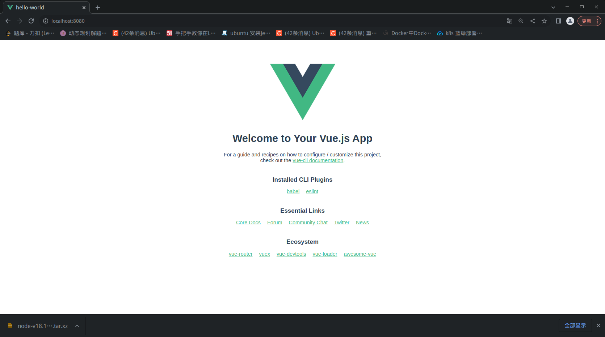
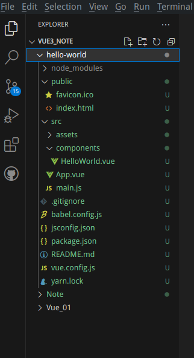
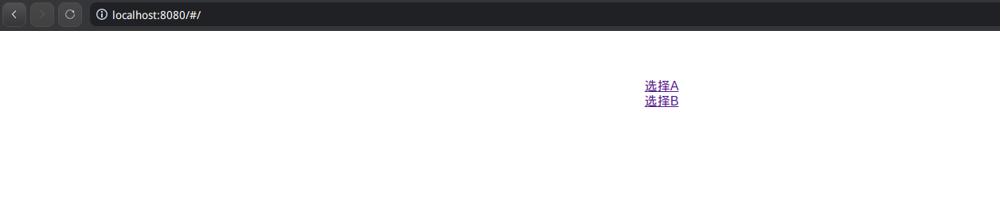
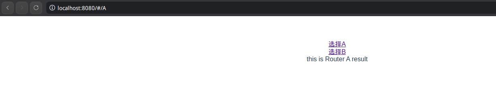
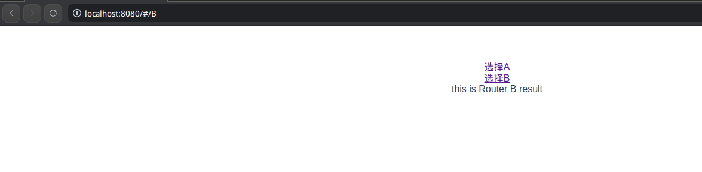
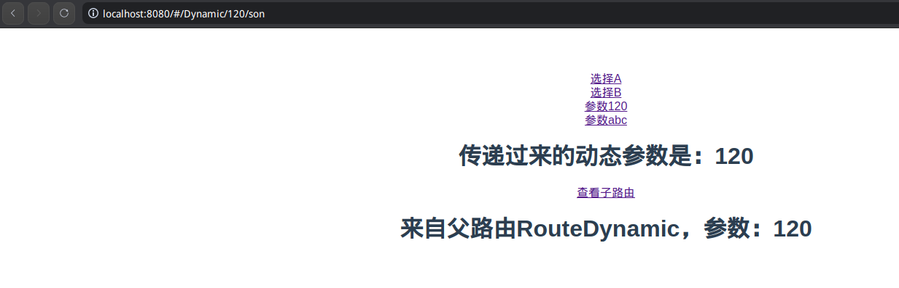
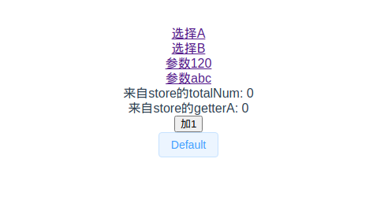

# nodejs、npm、yarn

下载步骤：

1. 官网下载tar包。
2. 解压tar包到指定目录。
3. 配置PATH环境变量。

nodejs是一个javascript运行时环境，由C和C++编写，可以解释并运行javascript代码，有点类似Java的JVM。**nodejs作为一个运行时环境，给予了js作为后端编程语言的能力**。

而npm是nodejs的一个依赖管理工具，有点类似Java的Mave、Golang的go mod。

为什么会需要这两个东西，首先npm是依赖nodejs运行的，在开发Vue工程时候，会面临以下2个问题：

1. 依赖管理混乱

   此时通过npm来管理依赖。

2. Vue工程不会浏览器认可

   在Vue工程化开发中，不是以Vue01/*.html那样通过脚本引入Vue，再通过脚本创建Vue应用挂载视图的方式实现的，而是使用.vue后缀名的文件承载Vue的功能。这些文件无法被浏览器的内核识别，因此需要专业的打包工具将Vue工程打包成原生的html与js，**这些打包工具依赖nodejs运行。**

因为墙的缘故，直接用npm管理依赖不太好，通常在国内会使用镜像，和maven配置镜像地址不同，npm可以安装一个cnpm的组件实现代理功能，后续的npm操作可以使用cnpm代替：

```bash
root@kjg-PC:~# npm install -g cnpm --registry=https://registry.npm.taobao.org
npm WARN deprecated @npmcli/move-file@2.0.1: This functionality has been moved to @npmcli/fs

added 469 packages in 17s

27 packages are looking for funding
  run `npm fund` for details
npm notice 
npm notice New minor version of npm available! 9.5.1 -> 9.6.6
npm notice Changelog: https://github.com/npm/cli/releases/tag/v9.6.6
npm notice Run npm install -g npm@9.6.6 to update!
npm notice 


root@kjg-PC:~# cnpm -v
cnpm@9.2.0 (/usr/local/nodejs/node-v18.16.0-linux-x64/node-v18.16.0-linux-x64/lib/node_modules/cnpm/lib/parse_argv.js)
npm@9.6.6 (/usr/local/nodejs/node-v18.16.0-linux-x64/node-v18.16.0-linux-x64/lib/node_modules/cnpm/node_modules/npm/index.js)
node@18.16.0 (/usr/local/nodejs/node-v18.16.0-linux-x64/node-v18.16.0-linux-x64/bin/node)
npminstall@7.8.0 (/usr/local/nodejs/node-v18.16.0-linux-x64/node-v18.16.0-linux-x64/lib/node_modules/cnpm/node_modules/npminstall/lib/index.js)
prefix=/usr/local/nodejs/node-v18.16.0-linux-x64/node-v18.16.0-linux-x64 
linux x64 5.15.77-amd64-desktop 
registr1y=https://registry.npmmirror.com
```

而yarn是类似cnpm的依赖管理工具，近年来被广泛使用，可以理解为cnpm的替代品：

```bash
root@kjg-PC:~# npm install -g yarn --registry=https://registry.npm.taobao.org

added 1 package in 1s
root@kjg-PC:~# yarn -v
1.22.19
```

# Vue-Cli

通过npm安装vue-cli

```bash
root@kjg-PC:~# npm install -g @vue/cli
root@kjg-PC:~# vue --version
@vue/cli 5.0.8
```

通过vue create新建一个Vue工程，选择Vue3：

```bash
kjg@kjg-PC:~/projects/front-end/Vue3_Note# vue create hello-world
```

进入工程目录，执行yarn serve启动项目，默认在localhost:8080启动：

```bash
kjg@kjg-PC:~/projects/front-end/Vue3_Note/hello-world# yarn serve
yarn run v1.22.19
$ vue-cli-service serve
 INFO  Starting development server...


 DONE  Compiled successfully in 4361ms                                                                                                                                14:05:27


  App running at:
  - Local:   http://localhost:8080/ 
  - Network: http://192.168.120.161:8080/

  Note that the development build is not optimized.
  To create a production build, run yarn build.

```



# Vue工程

## 整体架构

用Vscode打开Vue工程：



里面有后缀名为vue的文件，它是Vue工程的专属文件，最终会被运行在nodejs的打包组件打包成html+css+js，部署在服务器上，这些资源会被客户端请求，再被nginx转发请求获取到，最终渲染到客户端（浏览器）上。比如执行yanr build命令，最终会将当前目录下的Vue工程打包为html+css+js资源（放在当前目录的dist/内）：

```bash
kjg@kjg-PC:~/projects/front-end/Vue3_Note/hello-world# yarn build
yarn run v1.22.19
$ vue-cli-service build
All browser targets in the browserslist configuration have supported ES module.
Therefore we don't build two separate bundles for differential loading.


⠋  Building for production...

 DONE  Compiled successfully in 9225ms                                                                                                                                08:43:29

  File                                 Size                                                              Gzipped

  dist/js/chunk-vendors.b1181f17.js    74.32 KiB                                                         27.93 KiB
  dist/js/app.6fdc708b.js              13.08 KiB                                                         8.41 KiB
  dist/css/app.2cf79ad6.css            0.33 KiB                                                          0.23 KiB

  Images and other types of assets omitted.
  Build at: 2023-05-20T00:43:30.056Z - Hash: 9dc67bbaffc5aa68 - Time: 9225ms

 DONE  Build complete. The dist directory is ready to be deployed.
 INFO  Check out deployment instructions at https://cli.vuejs.org/guide/deployment.html
       
Done in 10.96s.
kjg@kjg-PC:~/projects/front-end/Vue3_Note/hello-world# tree dist/ -d
dist/
├── css
└── js

2 directories
```

App.vue和main.js是根组件，有点类似SpringBoot的启动类，components下面一般是开发人员自定义的子组件：

```javascript
// 从vue模块引入createApp方法
import { createApp } from 'vue'
// 从App.vue模块引入App对象，即包含data、methods、components的Model
import App from './App.vue'
// 挂载视图到index.html文件下的app
createApp(App).mount('#app')
```

```vue
<template>
  
  <!-- 3.使用HelloWorld组件，传入msg，最终根据HelloWorld的模板打印msg -->
  <HelloWorld msg="Welcome to Your Vue.js App"/>
</template>

<script>
// 1.从HelloWorld.vue引入HelloWorld组件
import HelloWorld from './components/HelloWorld.vue'

export default {
  name: 'App',
    // 2.将HelloWorld组件作为自己的子组件
  components: {
    HelloWorld
  }
}
</script>

<style>
#app {
  font-family: Avenir, Helvetica, Arial, sans-serif;
  -webkit-font-smoothing: antialiased;
  -moz-osx-font-smoothing: grayscale;
  text-align: center;
  color: #2c3e50;
  margin-top: 60px;
}
</style>
```

## Vue Router

用来处理Vue工程中，`访问路径`和`展示内容`的路由关系，比如在Vue工程中访问/A路径就展示A组件的内容，访问/B路径就展示B组件的内容：

```bash
kjg@kjg-PC:~/projects/front-end/Vue3_Note/hello-world# npm install vue-router@4
```

### 普通路由

1. 在.components/目录下定义子组件：

   ./components/RouterA.vue:

   ```vue
   <template>
       this is Router A result
   </template>
   ```

   ./components/RouterB.vue:

   ```vue
   <template>
       this is Router B result
   </template>
   ```

2. 在./routers目录下定义路由器模块router.js：

   ```javascript
   import RouterA from './components/RouterA.vue'
   import RouterB from './components/RouterB.vue'
   
   const routes = [
       {
           path: '/A',
           component: RouterA
       },
       {
           path: '/B',
           component: RouterB
       }
   ]
   ```

3. 在router.js内引入vue-router模块，根据路由结果，定义路由器，并作为router导出模块

   ```java
   // 从vue-router引入createRouter,createWebHashHistory函数
   import { createRouter,createWebHashHistory } from 'vue-router'
   
   // 定义路由器，将路由结果配置到路由器里
   const router = createRouter({
       history: createWebHashHistory(),
       routes
   })
       
   // 将自己作为router模块导出去
   export default router
   ```

4. 在main.js引入刚才自定义的router模块，在创建根Model的之后，挂载视图之前，使用router：

   ```javascript
   import { createApp } from 'vue'
   import App from './App.vue'
   // 引入自定义好的路由器
   import router from './routers/router'
   
   // 创建model的时候，选择路由器
   let app = createApp(App).use(router)
   app.mount('#app')
   ```

5. 在页面的Vue组件上，使用router-link标签，同时使用router-view展示路由结果：

   ```vue
   <template>
     <p>
       <router-link to="/A">选择A</router-link><br>
       <router-link to="/B">选择B</router-link><br>
       <!-- 根据上面的选择， 在RouterView展示结果 -->
       <router-view></router-view>
     </p>
   </template>
   ```

6. 最终效果：

   





### 动态路由

在配置动态路由/dynamic/:id后，访问/dynamic/1会路由到/dynamic/:id对应的子组件内，并且将1作为id的参数值传过去。子组件可以通过$route.params.id拿到1这个id值：

1. ./components/RouterDynamic.vue

   ```vue
   <template>
       <h1> 传递过来的动态参数是：{{ $route.params.customerParam }} </h1>
   </template>
   ```

2. ./routers/router.js

   ```javascript
   import RouterDynamic from '../components/RouterDynamic.vue'
   // 从vue-router引入createRouter,createWebHashHistory函数
   import { createRouter,createWebHashHistory } from 'vue-router'
   
   
   const routes = [
       {
           path: '/Dynamic/:customerParam',
           component: RouterDynamic
       }
   ]
   
   // 定义路由器，将路由结果配置到路由器里
   const router = createRouter({
       history: createWebHashHistory(),
       routes
   })
   
   // 将自己作为router模块导出去
   export default router
   ```

3. App.vue

   ```vue
   <template>
     <p>
       <router-link to="/Dynamic/120">参数120</router-link><br>
       <router-link to="/Dynamic/abc">参数abc</router-link><br>
       <!-- 根据上面的选择， 在RouterView展示结果 -->
       <router-view></router-view>
     </p>
   </template>
   ```

### 子路由

即命中某个路由R1的情况下，再命中R1内的子路由。打个比方，定义了R1路由/R1，在R1路由又定义了子路由R2。浏览器请求/R1时会命中R1路由，在请求/R1/R2时会命中R1和R2路由。

1. 新增子路由组件./components/RouterDynamicSon.vue

   ```vue
   <template>
       <h1> 来自父路由RouteDynamic，参数：{{$route.params.customerParam}} </h1>
   </template>
   ```

2. 修改动态路由RouterDynamic，新增子路由son：

   ```javascript
   import RouterDynamicSon from '../components/RouterDynamicSon.vue'
   
   const routes = [
       {
           path: '/Dynamic/:customerParam',
           component: RouterDynamic,
           children: [
               {
                   path: 'son',
                   component: RouterDynamicSon
               }
           ]
       }
   ]
   ```

3. 在./components/RouterDynamic.vue组件新增路由选项：

   ```vue
   <template>
       <h1> 传递过来的动态参数是：{{ $route.params.customerParam }} </h1>
       <router-link v-bind:to="'/Dynamic/' + $route.params.customerParam + '/son'">查看子路由</router-link><br>
       <router-view></router-view>
   </template>
   ```

4. 最终效果：

   

### 路由命名

实际上，在工程项目中通过"/xx"的方式使用路由会比较繁琐，可以通过给路由命名，然后使用命名的方式使用路由，这样比较优雅一点：

1. ./routers/router.js

   ```javascript
   const routes = [
       {
           path: '/Dynamic/:customerParam',
           name: 'routerDynamic',
           component: RouterDynamic,
           children: [
               {
                   name: 'son',
                   path: 'son',
                   component: RouterDynamicSon
               }
           ]
       }
   ]
   ```

2. ./App.vue

   ```vue
   <template>
     <p>
       <router-link to="/A">选择A</router-link><br>
       <router-link to="/B">选择B</router-link><br>
       <router-link v-bind:to="{name: 'routerDynamic',params:{customerParam:'120'}}">参数120</router-link><br>
       <router-link v-bind:to="{name: 'routerDynamic',params:{customerParam:'abc'}}">参数abc</router-link><br>
       <!-- 根据上面的选择， 在RouterView展示结果 -->
       <router-view></router-view>
     </p>
   </template>
   ```

3. ./components/RouterDynamic.vue

   ```vue
   <template>
       <h1> 传递过来的动态参数是：{{ $route.params.customerParam }} </h1>
       <router-link v-bind:to="{name: 'son'}">查看子路由</router-link><br>
       <router-view></router-view>
   </template>
   ```
   

### 导航守卫

可以理解为SpringMVC里的拦截器，用来控制从A组件路由到B组件过程中的拦截操作，根据操作结果决定路由结果。在项目中往往配合鉴权使用。导航守卫有`全局`、`组件`、`单路由结果`之分。

全局：

```javascript
// 定义路由器，将路由结果配置到路由器里
const router = createRouter({
    history: createWebHashHistory(),
    routes
})

// 定义全局导航守卫
router.beforeEach((from,to)=>{
    console.log(from)
    console.log(to)
    // 默认放行
    return true
})
```

单路由结果：

```javascript
const routes = [
    {
        path: '/Dynamic/:customerParam',
        name: 'routerDynamic',
        component: RouterDynamic,
        children: [
            {
                name: 'son',
                path: 'son',
                component: RouterDynamicSon
            }
        ],
        beforeEnter:[(to,from)=>{
            console.log(to)
            console.log(from)
            // 默认放行
            return true
        }]
    }
]

// 定义路由器，将路由结果配置到路由器里
const router = createRouter({
    history: createWebHashHistory(),
    routes
})
```

### 总结

Vue Router的细节，可以在具体开发过程中翻阅官方文档：https://router.vuejs.org/zh/guide/

## VueX

可以理解为Vue里的全局变量管理组件，有点类似IOC容器，但不提供DI的功能。它的核心思想是在VueX实例里声明变量、操作方法，只要根组件使用了这个VueX实例，那么根Model以及其子组件都能使用VueX声明的变量和方法，**实现变量的全局管理**。

安装：

```bash
kjg@kjg-PC:~/projects/front-end/Vue3_Note/hello-world# npm install vuex@next --save
```

使用：

1. 创建一个store（VueX存储变量、操作变量的具体单位）

   ```javascript
   // 创建store实例
   const store = createStore({
       // 可以理解为组件的data()
       state() {
           return {
               totalNum: 0
           }
       },
       // 可以理解为组件的methods
       mutations: {
           increment(state) {
               state.totalNum++
           }
       },
       // 可以理解为组件的属性计算
       getters: {
           getterA(state){
               return state.totalNum * 10
           }
       }
   })
   
   let app = createApp(App).use(router).use(store)
   ```

2. 在其他组件使用store

   ```vue
   <template>
     <p>
       <span>来自store的totalNum: {{ $store.state.totalNum }}</span><br>
         <span>来自store的getterA: {{ useGetterA }}</span><br> 
       <button @click="()=>{this.$store.commit('increment')}">加1</button>
     </p>
   </template>
   
   <script>
   export default {
     name: 'App',
     components: {
     },
     computed: {
       useGetterA(){
         return this.$store.getters.getterA
       }
     }
   }
   </script>
   ```

### 总结

VueX还有module的概念，具体在开发过程中查看文档：https://vuex.vuejs.org/zh/guide/modules.html

## UI组件

以element-plus搭配Vue3工程举例。

安装：

```bash
kjg@kjg-PC:~/projects/front-end/Vue3_Note/hello-world# npm install element-plus
```

在根组件中使用ElementPlus：

```javascript
import ElementPlus from 'element-plus'

let app = createApp(App).use(router).use(store).use(ElementPlus)
app.mount('#app')
```

在Vue文件中使用element-plus：

```vue
<template>
  <p>
    <el-button>Default</el-button>
  </p>
</template>
```

最终效果：

